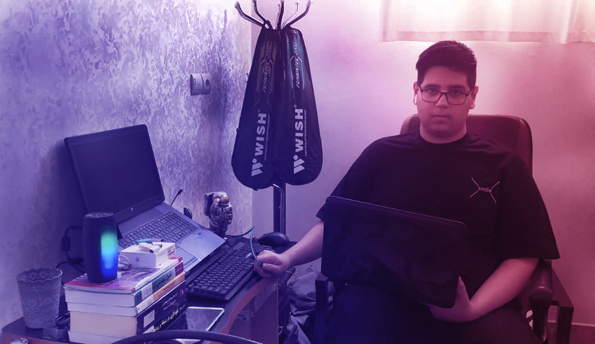

  

# Hey 👋, I'm Mohammad Taha Hatami

🚀 **16 y/o Developer** | Passionate about **Web Security**, **Python**, and **Creative Automation with AI**

🛡️ I work on both **Offensive** and **Defensive** sides of cybersecurity — from exploiting vulnerabilities to securing systems.

👨‍💻 Founder of [Abartarah.ir](https://abartarah.ir) – Tools, Experiments & Web Madness 😈

---

### 🌐 Connect with me

  
  
  
  
  

<h3 align="center">
  پروژه‌های این گیت‌هاب برای <strong>تست نفوذ وب</strong>، <strong>هک کاربردی</strong> و <strong>کارگاه‌های آموزشی جرایم سایبری</strong> طراحی شده‌اند.
</h3>

---

> 🎯 Check out my **Live Terminal-Style Preview** on [abartarah.ir/github](https://abartarah.ir/github)

---
